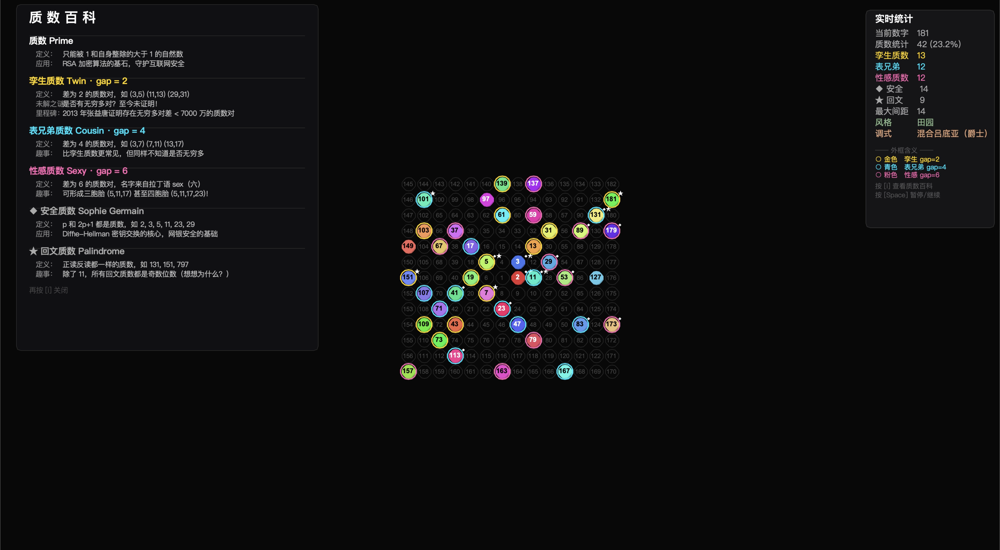

# Musical Ulam Spiral 音乐乌拉姆螺旋

一个带有实时质数音乐化的乌拉姆螺旋动画。质数被映射为钢琴旋律，特殊质数家族拥有独特的乐器和视觉标记，每次运行随机生成不同的音乐风格。



## 功能特性

### 视觉

- 基于 Python turtle 的**乌拉姆螺旋**动画，深黑背景
- 每个**质数**拥有独特颜色（黄金比例 HSL 分布），数字居中显示
- **特殊质数家族**用彩色外框和符号标记：
  | 外框颜色 | 含义 | 定义 |
  |---------|------|------|
  | 金色 | 孪生质数 Twin | 与前一个质数差为 2，如 (11, 13) |
  | 青色 | 表兄弟质数 Cousin | 差为 4，如 (7, 11) |
  | 粉色 | 性感质数 Sexy | 差为 6，如 (5, 11) |
  | ◆ 符号 | Sophie Germain 安全质数 | p 和 2p+1 都是质数 |
  | ★ 符号 | 回文质数 | 正读反读一样，如 131 |
- **非质数**显示为极淡圆环 + 灰色数字
- **实时统计面板**（右侧）：各类质数计数、外框图例、音乐风格信息
- **质数百科面板**（按 `i` 键）：定义、应用、趣事

### 音乐 / 声音化

基于 **FluidSynth** + **FluidR3_GM** 音色库（141 MB 专业 GM 音色）。

#### 乐器分配
| 通道 | 角色 | 乐器 |
|------|------|------|
| ch0 | 普通质数 | Acoustic Grand Piano（钢琴，GM 0） |
| ch1 | 孪生质数 | 钢琴大三和弦 |
| ch2 | 表兄弟质数 | Orchestral Harp（竖琴，五度双音） |
| ch3 | 性感质数 | String Ensemble（弦乐，五度双音） |
| ch4 | 低音铺底 | String Ensemble（弦乐，持续根音） |

#### 旋律设计
- **波浪式走向**：音符沿调式上行再下行（do-re-mi-fa-sol-la-sol-fa-mi-re-do...），自然流畅
- **八度交替**：每个波浪周期在 C4 与 C5 之间切换
- **轻柔力度**：velocity 30–42，极致温柔
- **混响**：轻柔短尾（size 0.15, damping 0.8, level 0.1），无合唱效果
- **结束**：三声部和声渐隐（钢琴根音 + 竖琴纯五度 + 弦乐大三度），自然衰减消散
- **烟花模式**（`--fireworks`）：独立的多阶段音效设计，见下方

#### 风格预设（每次运行随机选择）
| 风格 | 可选调式 |
|------|---------|
| 月光 | 小调、大调 |
| 晨曦 | 大调、五声音阶 |
| 夜想 | 小调、多利亚 |
| 田园 | 大调、混合吕底亚 |
| 冥想 | 五声音阶、小调 |

### 烟花尾声（`--fireworks`）

螺旋动画完成后，触发一场华丽的烟花表演：

#### 动画阶段
| 阶段 | 时长 | 描述 |
|------|------|------|
| 数字放大 | ~1s | 最后一个数字在中心逐渐放大，色彩流转 |
| 火箭升空 | ~1.5s | 数字向上飞升，尾焰粒子拖尾，加速上行滑音 |
| 约数分裂 | ~2.3s | 数字在顶部炸裂为所有约数，五颜六色坠落 |
| 九波烟花 | ~6.6s | 9 波次烟花依次绽放，每波风格各异，第 9 波「火树银花」全屏齐放 |
| 祝福横幅 | ~24s | 带 Emoji 装饰的祝福语缓缓从右飘入，闪烁星星环绕，数字球在下方漂浮 |

#### 九波烟花设计
1. 中心金色爆破
2. 左侧红色花束
3. 右侧蓝紫瀑布
4. 双侧对称绿色
5. 高空粉色瀑布
6. 三点齐放（橙 + 青 + 紫）
7. 宽幅银色瀑布
8. 四角彩虹齐放
9. **火树银花大结局** — 13 个子爆炸点全屏覆盖，超大粒子、超高速度

#### 烟花音效
- **蓄力**：低音弦乐渐强 + 钢琴低音震音
- **升空**：快速上行钢琴滑音 + 竖琴颤音 + 弦乐渐强
- **分裂**：全乐器爆裂和弦 + 下行琶音 + 竖琴叮咚
- **爆炸**：每波独立和弦（不同音高）+ 高音区噼啪碎裂 + 竖琴闪烁琶音 + 弦乐铺底
- **横幅**：缓慢钢琴旋律 + 竖琴点缀 + 弦乐持续音，渐弱终止和声

## 环境要求

- Python >= 3.14
- [FluidSynth](https://www.fluidsynth.org/)（`brew install fluid-synth`）
- [FluidR3_GM.sf2](https://member.keymusician.com/Member/FluidR3_GM/) — 放置在项目根目录

```bash
pip install pygame-ce pyfluidsynth
```

或使用 [uv](https://docs.astral.sh/uv/)：
```bash
uv sync
```

## 使用方法

```bash
# 默认：500 个数字，中等窗口，无声音
python ulam_spiral_mr_zou.py

# 开启音乐
python ulam_spiral_mr_zou.py --sound

# 以暂停状态启动（按空格开始）
python ulam_spiral_mr_zou.py --sound --paused

# 自定义数量和窗口大小
python ulam_spiral_mr_zou.py 800 --size large --sound

# 从指定数字开始
python ulam_spiral_mr_zou.py --start 1000 --sound

# 烟花尾声（螺旋完成后自动播放）
python ulam_spiral_mr_zou.py 100 --size small --sound --fireworks

# 烟花尾声（无音乐，仅视觉）
python ulam_spiral_mr_zou.py 100 --size small --fireworks
```

### 快捷键
| 按键 | 功能 |
|------|------|
| `Space` | 暂停 / 继续 |
| `i` | 展开 / 收起质数百科 |
| `q` / `Esc` | 退出（暂停时） |

### 命令行参数
| 参数 | 说明 | 默认值 |
|------|------|--------|
| `count` | 绘制的数字数量 | small=200, mid=500, large=1200 |
| `--size` | 窗口尺寸：`small`、`mid`、`large` | `mid` |
| `--start` | 起始数字 | 1 |
| `--sound` | 开启音乐 | 关闭 |
| `--paused` | 以暂停状态启动 | 关闭 |
| `--fireworks` | 螺旋完成后播放烟花尾声 | 关闭 |
